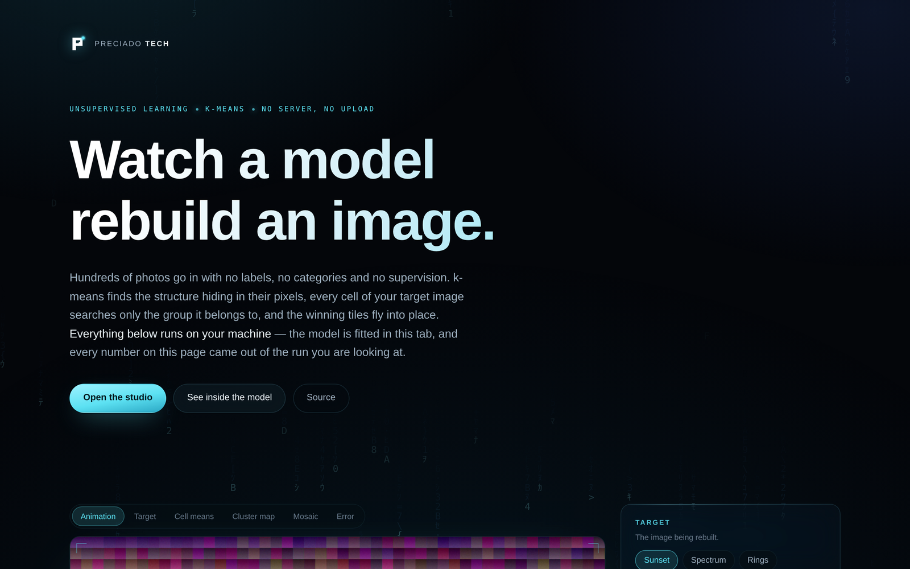
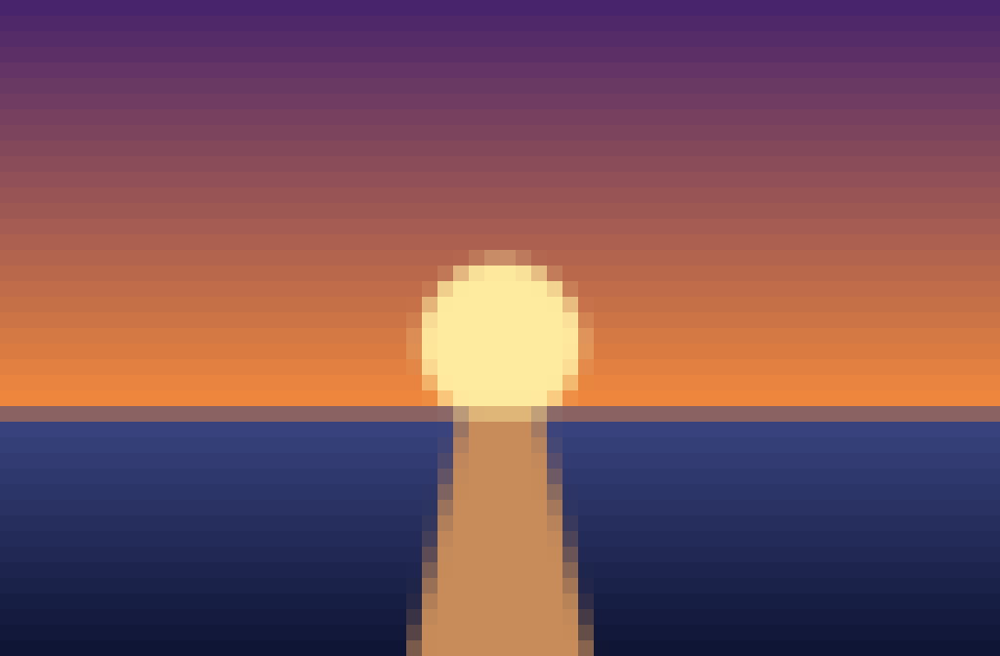
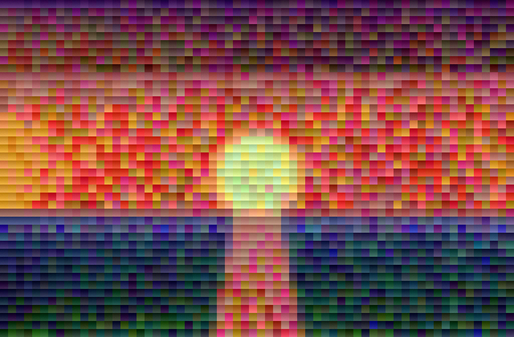
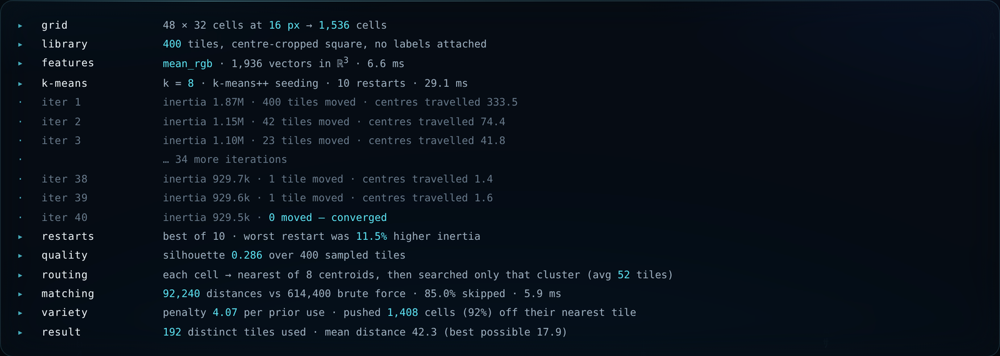
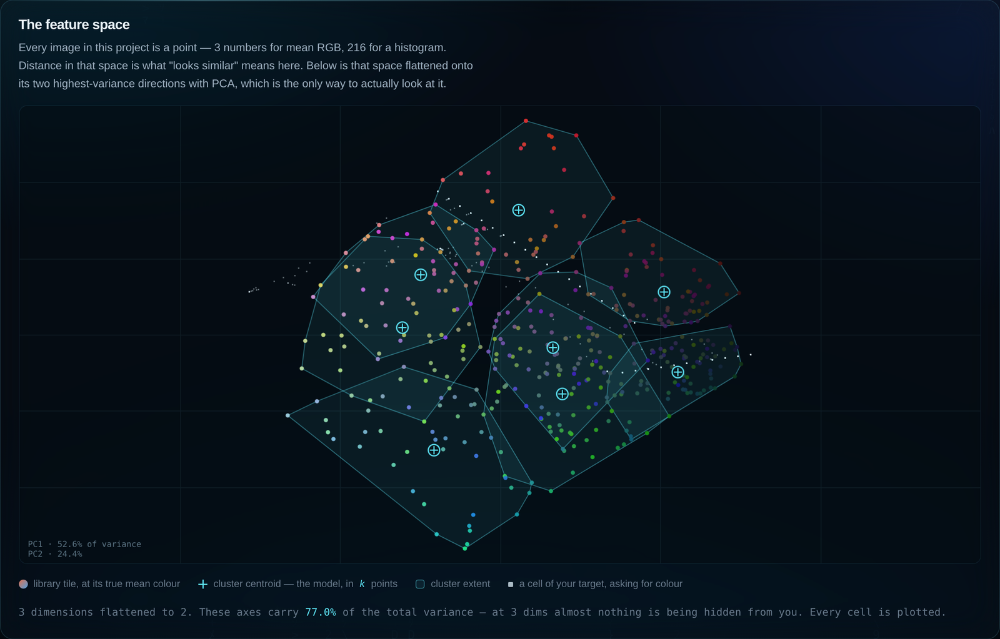

# Preciado Mosaic — an unsupervised-learning photo mosaic generator

Reconstructs a target image as a mosaic of source photos, using **k-means
clustering** to organize the source library, then animates the tiles flying
into place.

Two front ends, one algorithm: a **Python CLI** (scikit-learn + Pygame) and
a **browser demo** (TypeScript, no backend) that ports the same pipeline
step for step.

The interesting half is the second one: the demo doesn't just show the
mosaic, it shows the model that built it — the convergence trace, the
feature space in 2-D, what the parameters cost, and the decision behind any
cell you point at. Clustering is normally invisible; here it isn't.

**[▶ Live demo](https://preciado-mosaic.vercel.app)** · everything runs
client-side — no uploads, no server. Both front ends can save a
**watermarked video** of the fly-in, encoded locally.



## How it works

```
target image ──► grid of tile-sized cells ──► feature per cell ─┐
                                                                ├─► matching ──► render / animate
source photos ──► tile thumbnails ──► feature per tile ──► k-means
```

1. **Grid** (`src/grid.py`) — the target is resized/cropped into an
   `R x C` grid of `tile_size` px cells.
2. **Sources** (`src/sources.py`) — every photo in a folder is
   center-cropped square and thumbnailed to tile size.
3. **Features** (`src/features.py`) — cells and tiles are embedded in the
   same feature space, so "visually similar" becomes "close in euclidean
   distance". Two extractors:
   - `mean_rgb` — average color, 3 dims. The simplest thing that works.
   - `histogram` — joint RGB histogram, 216 dims, **soft-binned**. Captures
     color *distribution*, so a half-red/half-blue tile no longer matches a
     uniform purple cell. (Soft binning is not cosmetic — see
     [What the numbers actually said](#what-the-numbers-actually-said).)
4. **Clustering — the unsupervised ML core** (`src/cluster.py`) — k-means
   partitions the tile library by visual similarity. No labels anywhere:
   the structure comes purely from the data. Contact sheets
   (`output/clusters/`) visualize each cluster so you can verify the
   grouping is sensible before anything depends on it, and `--scan-k`
   prints inertia (elbow method) and silhouette score across a range of k
   to justify the choice.
5. **Matching** (`src/matching.py`) — each cell finds its nearest **cluster
   centroid** first, then searches only within that cluster — the same
   coarse-quantization idea behind IVF approximate nearest-neighbor indexes
   (FAISS et al.), except here the index is the unsupervised model itself.
   A data-scaled **variety penalty** handicaps already-used tiles so one
   average-looking photo doesn't carpet the mosaic.
6. **Render + animate** (`src/render.py`, `src/animate.py`) — static PNG
   first, then a Pygame animation: tiles start scattered off-screen and fly
   into their slots on a staggered diagonal sweep, ease-out-cubic, tinted
   cyan in flight and cooling to true color as they land. `--record` renders
   the same timeline headlessly at a fixed timestep and writes a video.

| grid preview (cell mean colors) | finished mosaic |
| --- | --- |
|  |  |

## Watching it work

Getting a mosaic out is the easy half. Every stage of the pipeline also
emits what it did, and the browser demo renders all of it:

- **Six stage views** over the same frame — the target, the cell means the
  matcher is actually chasing, the **cluster map** (the target repainted in
  exactly `k` colors: the model's own resolution), the mosaic, and an
  **error map** of where the library ran out of colors. Turning `k` up and
  watching the cluster map resolve is the most direct answer to "what does
  k do" I know of.
- **A run log** — every stage with the numbers it produced, including the
  Lloyd iterations one by one: inertia falling, reassignments hitting zero,
  how far the centroids travelled.

  

- **The feature space**, projected to 2-D with PCA (power iteration, top two
  components, `web/src/lib/projection.ts`). Colored dots are library tiles
  at their true mean color, outlines are the partition k-means found,
  crosses are the centroids, and the white haze is where the target's cells
  are asking for color. Empty white regions are the honest failure mode of a
  photo mosaic. The panel reports how much variance the two axes carry, so
  the picture states its own fidelity.

  

- **Convergence, restarts, and the k sweep** — inertia per iteration, the
  spread across the ten k-means++ restarts (the argument for `n_init > 1`,
  or its null result), and inertia vs. silhouette across k = 2…16 on demand.
- **A per-cell inspector** — hover any cell of the finished mosaic to see
  the colour it asked for, which cluster it was routed to, how many tiles
  that left to search, what it got, and — when the variety penalty took its
  first choice away — what it could have had.
- **A ledger for the variety penalty**, pricing the trade explicitly: how
  much fidelity was given up, for how many distinct photos on screen.

## Quick start

```bash
python -m venv .venv && .venv/bin/pip install -r requirements.txt

# generate synthetic demo assets (or drop your own photos into assets/)
.venv/bin/python scripts/make_demo_assets.py

.venv/bin/python -m src.main \
    --target assets/targets/demo_sunset.png \
    --sources assets/sources \
    --tile-size 16 --grid-cols 48 --k 8 --feature mean_rgb --animate
```

Outputs land in `output/`: `grid_preview.png` (blocky mean-color sanity
check), `clusters/cluster_XX.png` (one contact sheet per cluster), and
`mosaic.png`. Use `--scan-k 2:12` for the k-selection report and
`--feature histogram` for the higher-dimensional features.

To save the animation instead of watching it:

```bash
.venv/bin/python -m src.main --target ... --sources ... --record output/mosaic.mp4
```

`--record` opens no window, so it works over SSH and in CI, and it advances
the animation on a fixed timestep rather than the wall clock — the same
inputs give you a byte-comparable video every time. It writes an MP4 when
`imageio[ffmpeg]` is installed and a numbered PNG sequence (plus the ffmpeg
command to stitch it) when it isn't. Frames carry a small Preciado Tech
signature in the corner; `--no-watermark` drops it.

Use your own images: point `--target` at any photo and `--sources` at any
folder of images. Portraits-of-friends as tiles, a group photo as target,
is the classic demo.

There's also a Gradio UI over the same pipeline:

```bash
.venv/bin/python -m src.ui        # http://127.0.0.1:7860
```

## The browser demo

`web/` is a dependency-free TypeScript port of the pipeline — the same
grid, features, k-means (k-means++ seeding, restarts by lowest inertia,
Lloyd iterations), cluster-first matching and variety penalty, with the
Pygame fly-in re-implemented on canvas. The math runs in a web worker; the
tile library ships as a single sprite atlas. No framework, no charting
library — the plots are ~400 lines of canvas in `web/src/lib/charts.ts`.

The port is verified against the Python implementation rather than just
eyeballed: feature vectors agree to float32 precision (max absolute
difference `9.9e-6` on values scaled to 255).

Video export uses `captureStream` + `MediaRecorder`, so the encode happens
in the tab and the file goes straight to the visitor's downloads. Frames are
pulled manually (`captureStream(0)` + `requestFrame`) so the recording holds
exactly the frames that were painted even if the tab drops below 60 fps. The
watermark is drawn by the animation itself rather than composited afterwards
— the clip is signed by construction, from the same glyph geometry the
Python side uses (`src/brand.py` ⇄ `web/src/lib/brand.ts`).

```bash
.venv/bin/python scripts/make_web_assets.py   # pack assets/sources into a sprite atlas
npm --prefix web install
npm --prefix web run dev
```

## What the numbers actually said

The interesting part of this project was the two places where the obvious
story turned out to be wrong. `scripts/evaluate_features.py` reproduces
all of it.

### 1. The "better" feature was worse, and the bins were why

The plan was a clean progression: mean RGB → histograms → better mosaics.
Measured on the demo library, hard-binned histograms were **worse than
plain averages** (per-pixel error 40.2 vs 32.6), and the mosaics looked
like static.

The cause is bin edges. Two nearly identical colors that fall either side
of a boundary share *no* histogram bins, so euclidean distance rates them
as far apart as red and blue — while a structurally wrong tile that happens
to straddle the right bin scores well. Switching to **soft (trilinear)
binning**, where each pixel splits its mass between the two nearest bin
centers per channel, closes almost the whole gap:

| feature | per-pixel error | mean-color error |
| --- | --- | --- |
| mean_rgb | **32.6** | **17.8** |
| histogram, hard bins | 40.2 | 30.0 |
| histogram, soft bins | 33.9 | 20.3 |

*(variety 0, k=8, 400 tiles, 1,536 cells — lower is better)*

Histograms still only match rather than beat mean RGB here, and that makes
sense: the bundled demo tiles are synthetic near-uniform swatches, so their
color *distribution* carries almost nothing their average doesn't. The
feature has little to work with until the tiles are real photos with
internal structure.

### 2. The variety penalty doesn't transfer between feature spaces

At `--variety 0.5`, histogram features look catastrophic next to mean RGB
(per-pixel error 91.0 vs 57.6). That reads like a broken feature, but it's
a mis-scaled knob. Variety is scaled by the *median nearest distance*, and
in 216-dim histogram space that quantity is large relative to the spread
between candidates, so the usage penalty swamps the color signal much
sooner.

Compared at equal tile diversity, the two features are indistinguishable:

| feature | variety | per-pixel error | distinct tiles |
| --- | --- | --- | --- |
| mean_rgb | 0.10 | 44.6 | 132 |
| histogram | 0.02 | 44.9 | 124 |

So `variety` is not a feature-independent dial. Use ~0.25 with mean RGB and
~0.02–0.05 with histograms. (A spread-scaled penalty was tried and helped
only marginally, so the simpler definition stayed.)

## Does the clustering pay off?

Cluster-first matching does roughly `k` times less distance work than brute
force — at k=8 over 400 tiles, 85% fewer distance computations. Whether
that shows up on the clock depends entirely on the runtime:

| | distance computations | Python (NumPy) | Browser (TypeScript) |
| --- | --- | --- | --- |
| brute force | 614,400 | 4.6 ms | 5.5 ms |
| cluster-accelerated | 92,240 | 5.4 ms | 2.5 ms |

In Python the brute-force path is a single BLAS-backed
`pairwise_distances` call while the clustered path is one call per cluster
— at this size vectorization beats asymptotics, and the "faster" algorithm
loses. In the browser both are hand-written loops, so the saved work
converts straight into wall clock, and the gap widens with feature
dimensionality: at 216-dim histograms and k=12 the browser demo measures
**~30× faster** than brute force.

That's the honest version of the claim: clustering reliably cuts *distance
computations*; it cuts *time* only when per-distance cost dominates
per-call overhead. Which is why real ANN systems adopt this structure at
million-vector scale, and why it looks underwhelming on a 400-tile toy in
NumPy.

## Choosing k

```bash
.venv/bin/python -m src.main --target assets/targets/demo_sunset.png --scan-k 2:12
```

Prints inertia (look for the elbow) and silhouette score (peaks where
clusters are best separated) for each k. On the demo library both are flat
and unremarkable — the synthetic tiles are spread evenly around the hue
wheel, so there's no natural cluster count to find. That's itself a useful
negative result: k here is a search-granularity parameter, not a discovery
of latent structure.

## Layout

```
src/            the pipeline: grid, sources, features, cluster, matching, render, animate
src/brand.py    the Preciado Tech mark + the video watermark
src/ui.py       Gradio UI over the same pipeline
web/src/lib/    the TypeScript port, one module per stage
web/src/lib/charts.ts      convergence, restarts, k sweep, feature space — hand-drawn canvas
web/src/lib/projection.ts  PCA to 2-D by power iteration
web/src/lib/record.ts      in-browser video capture
scripts/        demo asset generation, web atlas packing, feature evaluation
assets/         demo target + synthetic source library
```

## Differentiation

Most photomosaic generators — including genetic-algorithm and FAISS-based
ones — don't frame themselves as unsupervised clustering demos, and none I
found combine that with a live animated tile-placement visual you can drive
in a browser. That combination, plus measuring the algorithm choices
instead of asserting them, is the point of this repo.
